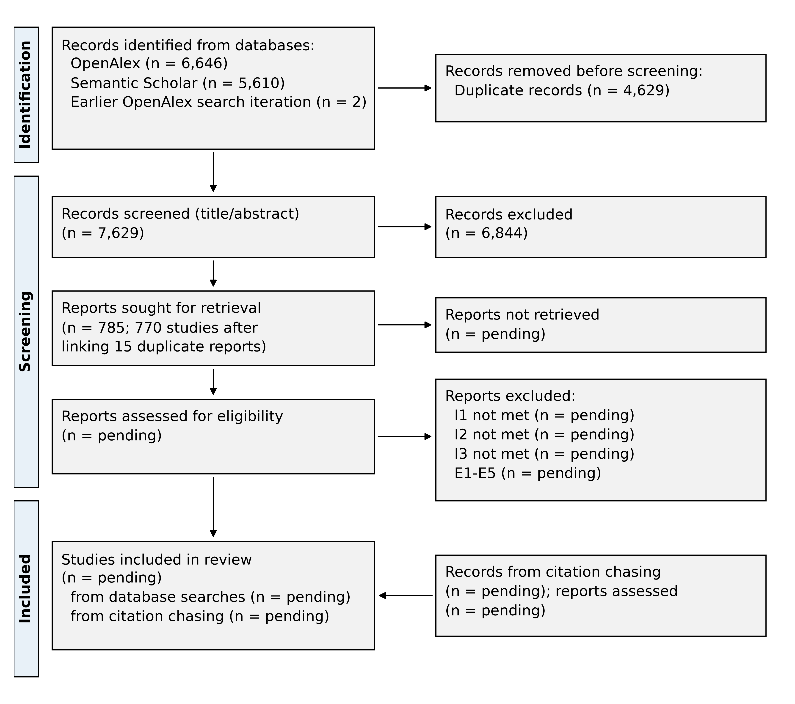

**Keywords:** distribution shift; domain adaptation; out-of-distribution generalisation; deep learning; precision agriculture; systematic review

**Highlights:** [TBD after synthesis; three to five bullets of at most 85 characters each.]

# Introduction

A model that recognises leaf disease, counts wheat ears or maps maize fields is trained on data from a few fields, seasons and devices. It is then used on others. Accuracy on held-out data from the training collection says little about accuracy on a new collection. The best-known case is still instructive. A convolutional network trained on PlantVillage images reached 99.35% accuracy on held-out PlantVillage images, but 31.40% and 31.69% on two small sets of images of the same crop–disease classes gathered from other sources [@mohanty2016deep]. The second pair of numbers is the one that predicts field use.

The statistical problem has a name. When the joint distribution of inputs and labels differs between training and use, error measured on the training distribution is a biased estimate of error in use [@quinonerocandela2008dataset; @morenotorres2012unifying]. Bounds on error in the new domain grow with the divergence between the two domains [@bendavid2009theory]. Machine learning now has benchmarks built around this problem: WILDS assembles real shifts, among them wheat-head images from different countries and acquisition sessions [@koh2020wilds]. A large controlled comparison of domain-generalisation algorithms found that, with fair model selection, none clearly beat ordinary empirical risk minimisation [@gulrajani2020search]. Ecology and remote sensing reached a related conclusion from another side. Random cross-validation of spatially structured data overstates predictive skill [@roberts2017crossvalidation], and predictions for conditions outside the feature space of the training data carry unknown error [@meyer2021predicting]. For a biomass map of central Africa, non-spatial validation suggested that more than half of the variance was explained, while spatial validation showed almost none [@ploton2020spatial].

Agricultural machine learning meets every kind of shift. Images move from controlled backgrounds to field clutter. Models move between farms, regions and countries, seasons alter crop appearance and phenology, cameras and satellites change, and cultivars and growth stages differ. For plant disease recognition, results obtained under experimental conditions hide factors that degrade performance in practice [@barbedo2018factors]. Broad reviews have catalogued architectures, datasets and in-distribution accuracy [@kamilaris2018deep; @liakos2018machine; @vanklompenburg2020crop] but did not measure this gap. Many primary studies report it: crop-type mapping across regions and years [@wang2019crop; @xu2020deepcropmapping; @kluger2021two; @nyborg2022timematch], crop–weed segmentation across fields, crops and robots [@bosilj2019transfer; @gogoll2020unsupervised], yield prediction for unseen years [@morales2023machine] and disease recognition from laboratory to field [@wu2023laboratory]. They report it in incompatible units and under different evaluation designs. How large the gap is, which shifts matter most, and whether current remedies close it therefore remain open. **[VERIFY before submission: three recent reviews retrieved by the search (screening ids R02966, R06651, R07003) must be read in full and positioned here.]**

This review asks three questions. How much performance is lost when crop-production models are evaluated out of distribution, and how does the loss vary with the type of shift and the task (RQ1)? When studies apply a remedy (domain adaptation, domain generalisation, fine-tuning on target data, or large-scale pretraining), what share of the gap is recovered, and with how many target labels (RQ2)? Are out-of-distribution evaluations designed and reported well enough for these numbers to be trusted (RQ3)?

**[Contribution statements will be written once the synthesis is complete.]**

# Methods

## Protocol

The protocol fixed the review questions, eligibility criteria, search strings, sentinel studies, extraction items, appraisal items and synthesis plan on 1 October 2026, before any search was run (Supplementary File S1). Departures from it are logged with date and reason; Section 2.9 lists them. Reporting follows the PRISMA 2020 statement [@page2021prisma]. **[AUTHOR DECISION: register the protocol on OSF Registries and cite its DOI here.]**

## Eligibility criteria

Eligible studies trained a supervised machine-learning model, classical or deep, for one of six crop-production tasks: (a) disease, pest or abiotic-stress recognition; (b) weed–crop discrimination; (c) detection, counting or segmentation of plants, organs or fruits; (d) estimation of plant phenotypic traits; (e) crop-type or cropland mapping; (f) yield estimation or forecasting. Three conditions had to hold.

- **I1.** The study is primary and empirical.
- **I2.** It reports performance on an in-distribution (ID) test set and on at least one out-of-distribution (OOD) test set, with the same metric and label space (or a reported common subset). The OOD domain differs from training in an identifiable factor: acquisition setting (laboratory or controlled to field), location (field, site, region or country), time (season or year), sensor or platform, or biological material (cultivar, species or growth stage).
- **I3.** The OOD result of the unadapted ("source-only") model is reported, so the gap can be computed.

Studies were excluded if they concerned livestock, aquaculture, forestry, post-harvest processing, soil-only mapping or land cover without crop classes (E1); created the shift only by synthetic perturbation, or trained on synthetic and tested on real images (E2); used random or k-fold splits only (E3); were reviews, editorials or non-English records, or could not be retrieved and reported no ID and OOD values in the abstract (E4); or tested on a label space disjoint from training (E5). Preprints were eligible; a preprint with a peer-reviewed version was replaced by that version.

During screening, nine operational rules were fixed when a study type first appeared and then applied to all records (Table B1). The most consequential: robot-navigation perception and variety or species identification fall outside tasks (a)–(f), and a single leave-one-year-out or spatial cross-validation without an ID comparator does not satisfy I2.

## Information sources and search

We searched OpenAlex [@priem2022openalex] and Semantic Scholar [@kinney2023semantic] in the title and abstract fields, for publication years 2015–2026. In OpenAlex the search was restricted to articles, preprints and reviews. The final string required a crop-domain term and either a machine-learning shift term, or a learning-method term together with a broader shift phrase (Appendix A). Semantic Scholar was searched on 1 October 2026 and OpenAlex on 2 October 2026 at 00:36 UTC, after its daily request quota had reset.

Search adequacy was tested against 13 reports of 12 sentinel studies named in the protocol before searching. Licensed indexes (Scopus, Web of Science) were not available. **[AUTHOR DECISION: re-run the strings in Scopus and Web of Science and screen the records not already in the pool.]** Backward and forward citation chasing of all included studies [@wohlin2014guidelines; @haddaway2022citationchaser] is in progress and will be reported in Section 3.1.

## Selection process

Records were deduplicated on DOI, then on normalised title and publication year (±1 year). An LLM-assisted screener (Claude Opus 5.5, Anthropic) applied the eligibility criteria to every record and recorded a decision and a task code for each inclusion. It worked from the title and keyword-in-context excerpts of the abstract: at most two windows of ±14 words around shift terms, at most 400 characters in total. Full abstracts were read for borderline records. Records without an abstract were judged on title alone. Screening was inclusive: a record went forward when the excerpt showed evaluation on a domain other than the training domain, or when the title named domain adaptation, domain generalisation, cross-domain testing or transferability. Reports of one study (conference and journal versions, preprint and article) were linked, and the most complete report is used for extraction.

After chance correction, LLM screening performance has ranged from none to moderate depending on the inclusion ratio [@khraisha2024can]. Selection therefore needs human verification. **[TBD before submission: the authors independently re-screen a random 20% of title/abstract decisions and all full-text decisions; Cohen's κ will be reported and disagreements resolved by discussion.]** Until then, selection is single-screener and is reported as such.

## Data items

One row is extracted per ID–OOD comparison: study identifiers; peer-review status; task; crop; data modality (proximal RGB, proximal multispectral or hyperspectral, UAV, satellite, tabular or weather); shift type and description; model family; training-set size; metric; ID value; source-only OOD value; mitigation (none, unsupervised domain adaptation, domain generalisation or augmentation, fine-tuning with *k* target labels, large-scale pretraining); adapted OOD value; number of target labels; target-trained ("oracle") value where reported; ID and OOD test-set sizes; number of runs; code and data availability. Every number carries its source location in the paper (table or figure) so that it can be re-checked.

## Appraisal of evaluation practice

No appraisal tool exists for out-of-distribution evaluations in agriculture. We adapted six items from the analysis and applicability domains of PROBAST+AI [@moons2025probast] and from the leakage taxonomy of @kapoor2023leakage. Each item is rated low, high or unclear concern:

- **Q1 domain separation:** OOD data come from fields, sites, years or devices absent from training and validation.
- **Q2 model selection:** hyperparameters, early stopping and checkpoints are chosen without OOD labels.
- **Q3 test size:** OOD test size is reported and at least 100 units (images, fields or site-years).
- **Q4 label consistency:** the same classes and annotation protocol are used across domains.
- **Q5 variability:** multiple runs or confidence intervals are reported.
- **Q6 availability:** code or data are public.

## Effect measures

For bounded metrics (accuracy, F1, mAP, AP50, mIoU, Dice, overall accuracy) the primary measure is retention, $\rho = m_\mathrm{OOD}/m_\mathrm{ID}$, with the absolute gap $\Delta = m_\mathrm{ID} - m_\mathrm{OOD}$ in percentage points as a secondary measure. Regression outcomes are summarised as $\Delta R^2$ and as the ratio of OOD to ID root-mean-square error, and are synthesised separately. For mitigations, the share of the gap recovered is $g = (m_\mathrm{adapted} - m_\mathrm{source}) / (m_\mathrm{ID} - m_\mathrm{source})$.

## Synthesis

Each study contributes one value per shift type to the primary analysis: the median of its comparisons. Studies that report many comparisons therefore do not dominate. We report medians with interquartile ranges, and 95% intervals from a cluster bootstrap that resamples studies (10,000 draws) [@field2007bootstrapping]. Heterogeneity is described, not pooled away. An inverse-variance meta-analysis is not attempted: most studies do not report the sampling variance of their metric, and metrics differ across tasks. Planned moderators are shift type, task, modality, model family, training-set size and publication year. Sensitivity analyses exclude preprints; exclude studies with high concern on Q1 or Q2; and restrict accuracy to a chance-corrected subset, $(\mathrm{acc} - 1/K)/(1 - 1/K)$ for $K$ classes.

## Departures from the protocol

Eight departures are logged (Appendix B). The search string was broadened twice after sentinel tests (recall 2 of the first 9 resolved sentinels with the original string, then 6 of 13, then 8 of 13 with the final string). Semantic Scholar was added because OpenAlex holds no abstract for many Elsevier records. The OpenAlex half of the final search ran on 2 October 2026 because of the daily quota. Screening used abstract excerpts and did not code exclusion reasons per record at title/abstract stage. The nine operational screening rules are listed in Table B1.

## Use of generative AI

Claude Opus 5.5 (Anthropic) ran the database queries through scripts, screened titles and abstracts as described in Section 2.4, and drafted text. All search scripts, exports and screening logs are kept for audit. **[AUTHOR DECISION: confirm this statement after reviewing the manuscript; the authors take responsibility for the content.]**

# Results

## Search and study selection

The searches returned 12,258 records: 6,646 from OpenAlex, 5,610 from Semantic Scholar, and 2 returned by an earlier iteration of the OpenAlex search but not by the final run (Fig. 1). After 4,629 duplicates were removed, 7,629 records were screened on title and abstract. Of these, 6,844 were excluded and 785 reports were sought for retrieval. Linking duplicate reports (15 pairs) left 770 studies.

The search retrieved 8 of the 13 sentinel reports, and screening kept all 8. The five missed reports [@mohanty2016deep; @ferentinos2018deep; @david2020global; @david2021global; @bosilj2019transfer] do not describe an out-of-domain test in their title or abstract; citation chasing is expected to recover them.

{width=100%}

**[Pending: reports retrieved and assessed; exclusions with reasons; studies included; characteristics of included studies (Table 1).]**

## Size of the generalisation gap (RQ1)

**[Pending full-text extraction.]**

## Recovery of the gap by mitigation (RQ2)

**[Pending full-text extraction.]**

## Evaluation and reporting practice (RQ3)

**[Pending full-text extraction.]**

# Discussion

**[Pending synthesis.]**

# Conclusions

**[Pending synthesis.]**

# Declarations {-}

**Declaration of generative AI use.** See Section 2.10. **[AUTHOR DECISION]**

**Data availability.** Search exports, deduplicated records, screening decisions, the extraction table and analysis code will be deposited in a public repository. **[AUTHOR DECISION: repository and DOI.]**

**Funding.** [AUTHOR DECISION]

**Declaration of competing interest.** [AUTHOR DECISION]

**CRediT author contributions.** [AUTHOR DECISION]

# References {-}

::: {#refs}
:::

# Appendix A. Search strings {-}

Both databases were searched in title and abstract with the same Boolean string (Semantic Scholar syntax: `+` for AND, `|` for OR). Publication years 2015–2026; OpenAlex types article, preprint and review.

```
QUERY3   = AGRI AND (SHIFT_ML OR (LEARN2 AND (SHIFT OR EXTRA)))

AGRI     = (crop OR crops OR plant OR plants OR weed OR weeds OR fruit OR fruits
            OR orchard OR vineyard OR wheat OR maize OR corn OR rice OR soybean
            OR potato OR tomato OR cassava OR agriculture OR agricultural
            OR cropland OR farmland OR phenotyping)

SHIFT_ML = ("domain shift" OR "domain adaptation" OR "domain generalization"
            OR "domain generalisation" OR "out-of-distribution"
            OR "distribution shift" OR "dataset shift" OR "test-time adaptation"
            OR "unsupervised domain")

LEARN2   = ("deep learning" OR "deep-learning" OR "machine learning"
            OR "neural network" OR "neural networks" OR "convolutional"
            OR "vision transformer" OR "random forest" OR "computer vision"
            OR "semantic segmentation" OR "object detection"
            OR "image classification" OR "classifier" OR "classifiers")

SHIFT    = ("domain shift" OR "domain adaptation" OR "domain generalization"
            OR "domain generalisation" OR "out-of-distribution"
            OR "distribution shift" OR "dataset shift" OR "cross-domain"
            OR "cross-dataset" OR "cross-region" OR "cross-site"
            OR "cross-season" OR "cross-year" OR "cross-location"
            OR "cross-sensor" OR "cross-crop" OR "cross-species"
            OR "unseen field" OR "unseen fields" OR "unseen region"
            OR "unseen regions" OR "unseen location" OR "unseen locations"
            OR "unseen year" OR "unseen years" OR "unseen season"
            OR "unseen environments" OR "leave-one-year-out"
            OR "leave-one-site-out" OR "leave-one-location-out"
            OR "leave-one-field-out" OR "spatial cross-validation"
            OR "spatial transferability" OR "temporal transferability"
            OR "spatiotemporal transferability" OR "spatial generalization"
            OR "temporal generalization" OR "spatiotemporal generalization"
            OR "lab-to-field" OR "laboratory to field" OR "in the wild"
            OR "test-time adaptation")

EXTRA    = ("new regions" OR "new region" OR "new field conditions"
            OR "new environments" OR "different regions" OR "other regions"
            OR "different years" OR "different sites" OR "different locations"
            OR "future years" OR "transferred across" OR "spatial transfer"
            OR "temporal transfer" OR "real-world conditions" OR "non-lab"
            OR "data partitioning")
```

# Appendix B. Departures from the protocol {-}

: Table B1. Logged departures from the protocol, with reasons.

| Date | Departure | Reason |
|:-----|:----------|:-------|
| 1 Oct 2026 | String extended with plain-language shift phrases (EXTRA). | Sentinel recall 2 of the first 9 resolved sentinels; missed abstracts describe their tests in plain language. |
| 1 Oct 2026 | Semantic Scholar added as a second database. | OpenAlex holds no abstract for many Elsevier records. |
| 1 Oct 2026 | Global Wheat Head Detection dataset papers treated as a recall check only. | Dataset papers may not report paired ID/OOD results. |
| 1 Oct 2026 | Final string QUERY3 (Appendix A). | Recall 6 of 13 with the previous string; 8 of 13 with QUERY3. |
| 2 Oct 2026 | OpenAlex half of QUERY3 run at 00:36 UTC. | Daily request quota exhausted on 1 October. |
| 1 Oct 2026 | Operational screening rules: (a) robot-navigation perception excluded; (b) variety, cultivar and species identification excluded; (c) cropland change detection and irrigated-cropland mapping count as task (e); (d) open-set, zero-shot and cross-domain few-shot studies with disjoint label spaces are E5; (e) OOD detection without an ID-vs-OOD task metric excluded; (f) single-scheme leave-one-year-out or spatial cross-validation without an ID comparator fails I2; (g) grassland, pasture, turf and forage excluded; (h) synthetic-to-real training, including radiative-transfer simulation, is E2; (i) weather- or genotype-only yield forecasting and crop recommendation excluded. | Study types not anticipated in the protocol; fixed when first met and applied to all records. |
| 1 Oct 2026 | Title/abstract screening on title plus abstract excerpts; exclusion reasons not coded per record at this stage. | Throughput over 7,629 records; PRISMA 2020 requires reasons only at full text; the planned human re-screen estimates sensitivity. |
| 1 Oct 2026 | Duplicate reports of one study linked (15 pairs). | Avoids double counting. |
