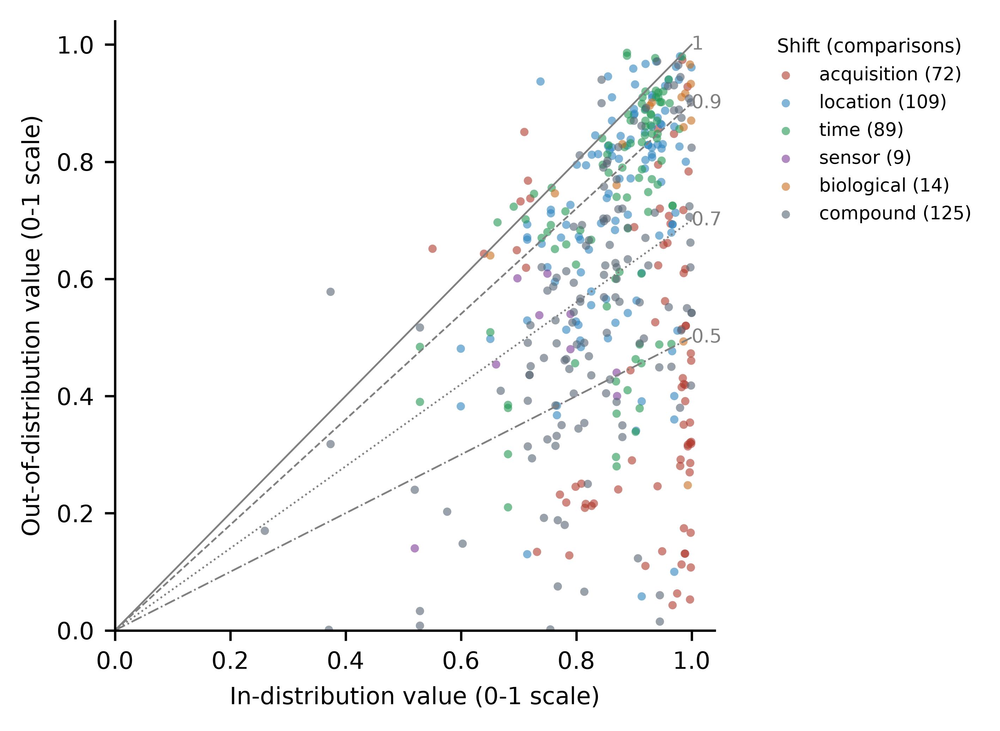
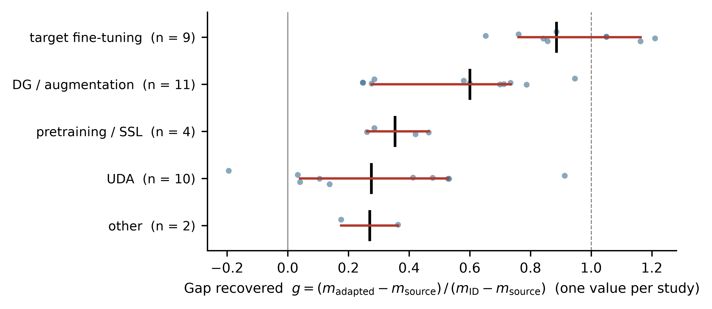
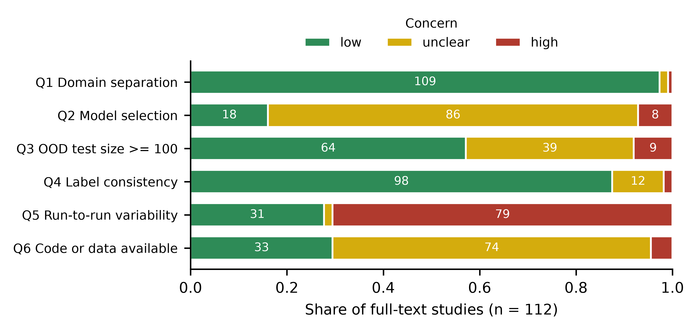

**Keywords:** distribution shift; domain adaptation; out-of-distribution generalisation; deep learning; precision agriculture; systematic review

**Highlights**

- {{v('n_included')}} studies give {{v('n_comparisons_total')}} paired in- and out-of-distribution results for crop models
- The median model keeps {{pc(v('ret_overall>median'))}}% of its in-distribution score; {{pc(v('sensitivity>full text only (excluding abstract-only)>median'))}}% in full-text studies
- Laboratory-to-field, sensor and compound shifts cost most; shifts in time cost little
- Target fine-tuning recovers {{pc(v('g_by_mit>target fine-tuning>median'))}}% of the gap; unsupervised adaptation {{pc(v('g_by_mit>UDA>median'))}}%
- {{ap('Q5','high')}}% of full-text studies report one run; {{ap('Q2','unclear')}}% do not say how models were selected

# Introduction

A model that recognises leaf disease, counts wheat ears or maps maize fields is trained on data from a few fields, seasons and devices, and is then used on others. Accuracy on held-out data from the training collection says little about accuracy on a new collection. The best-known case is still instructive. A convolutional network trained on PlantVillage images reached 99.35% accuracy on held-out PlantVillage images but 31.40% and 31.69% on two small sets of images of the same crop–disease classes taken from other sources [@mohanty2016deep]. The second pair of numbers is the one that predicts field use.

The statistical problem has a name. When the joint distribution of inputs and labels differs between training and use, error measured on the training distribution is a biased estimate of error in use [@quinonerocandela2008dataset; @morenotorres2012unifying], and bounds on error in the new domain grow with the divergence between the two domains [@bendavid2009theory]. Machine learning now has benchmarks built around real shifts; WILDS includes wheat-head images from different countries and acquisition sessions [@koh2020wilds]. A large controlled comparison found that, once model selection was made fair, no domain-generalisation algorithm clearly beat ordinary empirical risk minimisation [@gulrajani2020search]. Ecology and remote sensing reached a related conclusion from the other side. Random cross-validation of spatially structured data overstates predictive skill [@roberts2017crossvalidation], and predictions for conditions outside the feature space of the training data carry unknown error [@meyer2021predicting]. For a biomass map of central Africa, non-spatial validation suggested that more than half of the variance was explained, while spatial validation showed almost none [@ploton2020spatial].

Agricultural machine learning meets every kind of shift. Images move from controlled backgrounds to field clutter; models move between farms, regions and countries; seasons change crop appearance and phenology; cameras and satellites are replaced; cultivars differ. Results obtained under experimental conditions hide factors that degrade disease recognition in practice [@barbedo2018factors]. Broad reviews have catalogued architectures, datasets and in-distribution accuracy [@kamilaris2018deep; @liakos2018machine; @vanklompenburg2020crop] without measuring the gap. Three recent reviews address it in part. One weighs 56 studies of deep learning in farming and reports that high scores on controlled data are often given without external, temporal or cross-site validation [@R02966]. Another organises 42 proximal and UAV imaging studies along scene, sensor, protocol and time shifts and proposes a benchmark agenda [@R06651]. A third surveys grape leaf disease detection and finds that cross-dataset transfer usually degrades results [@R07003]. Judged from their abstracts, none converts paired ID and OOD results into a common effect size across tasks and modalities. Many primary studies do report the gap: for crop-type mapping across regions and years [@wang2019crop; @xu2020deepcropmapping; @kluger2021two; @nyborg2022timematch], for crop–weed segmentation across fields, crops and robots [@bosilj2019transfer; @gogoll2020unsupervised] and for disease recognition from laboratory to field [@wu2023laboratory]. They report it in incompatible units and under different designs. How large the gap is, which shifts matter most and whether current remedies close it are therefore open questions.

This review asks three. How much performance is lost when crop-production models are evaluated out of distribution, and how does the loss vary with the type of shift and the task (RQ1)? When studies apply a remedy, what share of the gap is recovered, and with how many target labels (RQ2)? Are OOD evaluations designed and reported well enough for these numbers to be trusted (RQ3)?

The review makes four contributions.

- It converts {{v('n_comparisons_total')}} ID–OOD comparisons from {{v('n_included')}} studies into one effect measure, retention, so that disease, weed, mapping and yield models can be compared on a common scale (Section 3.3).
- It ranks shift types by the performance they cost and checks the ranking inside studies that tested more than one shift, where data, task and authors are held fixed (Tables 2 and 3).
- It measures the share of the gap that each family of remedies recovers, relative to both the ID result and a target-trained reference (Table 4).
- It appraises six aspects of evaluation practice in {{v('n_appraised')}} full-text studies and derives a minimum reporting set for OOD evaluations (Table 6).

# Methods

## Protocol and reporting

The protocol fixed the review questions, eligibility criteria, search strings, sentinel studies, extraction items, appraisal items and synthesis plan on 1 October 2026, before any search was run. It was not registered. The protocol and its dated deviation log are released with the review data (Data availability). Reporting follows the PRISMA 2020 statement [@page2021prisma]; the checklist is in Appendix D.

## Eligibility criteria

Eligible studies trained a supervised machine-learning model, classical or deep, for one of six crop-production tasks: (a) disease, pest or abiotic-stress recognition; (b) weed–crop discrimination; (c) detection, counting or segmentation of plants, organs or fruits; (d) estimation of plant phenotypic traits; (e) crop-type or cropland mapping; (f) yield estimation or forecasting. Three conditions had to hold.

- **I1.** The study is primary and empirical.
- **I2.** It reports performance on an in-distribution (ID) test set and on at least one out-of-distribution (OOD) test set, with the same metric and label space (or a reported common subset). The OOD domain differs from training in an identifiable factor: acquisition setting (laboratory or controlled to field), location (field, site, region or country), time (season or year), sensor or platform, or biological material (cultivar, species or growth stage).
- **I3.** The OOD result of the unadapted ("source-only") model is reported, so that the gap can be computed.

Studies were excluded if they concerned livestock, aquaculture, forestry, post-harvest processing, soil-only mapping or land cover without crop classes (E1); created the shift only by synthetic perturbation, or trained on synthetic and tested on real data (E2); used random or k-fold splits only (E3); were reviews, editorials or non-English records, or could not be retrieved and reported no ID and OOD values in the abstract (E4); or tested on a label space disjoint from training (E5). Preprints were eligible. A preprint with a peer-reviewed version was replaced by that version.

Two design variants satisfy I2. A study that evaluates the same model specification under a random split (ID) and under a domain-defined split (OOD) of the same data qualifies, whereas a single leave-one-year-out or spatial cross-validation without an ID comparator does not. When every test in a study is held out in time, as in out-of-year yield forecasting, the same-region out-of-year result serves as the ID value for a location shift. A study that reports source-only and target-trained ("oracle") results on the OOD test set but no ID result was included under code INCLUDE-O and contributes to the oracle-referenced analyses only. Nine operational rules were fixed when a study type first appeared and then applied to all records (Table B1). The most consequential place robot-navigation perception and variety or species identification outside tasks (a)–(f), and exclude grassland and forage.

## Information sources and search

We searched OpenAlex [@priem2022openalex] and Semantic Scholar [@kinney2023semantic] in title and abstract for publication years 2015–2026; in OpenAlex the search was restricted to articles, preprints and reviews. The final string required a crop-domain term and either a machine-learning shift term, or a learning-method term together with a broader shift phrase (Appendix A). Semantic Scholar was searched on 1 October 2026 and OpenAlex on 2 October 2026 at 00:36 UTC, after its daily request quota had reset. Licensed indexes (Scopus, Web of Science) were not available.

Search adequacy was tested against 13 reports of 12 sentinel studies named in the protocol. The sentinel studies that the search did not retrieve were sought directly ("other methods" in Fig. 1). Recall is reported in Section 3.1. Backward and forward citation chasing of the included studies, planned in the protocol, was not performed: the bibliographic services it requires were not reachable from the analysis environment.

## Selection process

Records were deduplicated on DOI, then on normalised title and publication year (±1 year). An LLM-assisted screener (Claude, Anthropic) applied the eligibility criteria to every record and recorded a decision and a task code for each inclusion. At the title and abstract stage it worked from the title and keyword-in-context excerpts of the abstract (at most two windows of ±14 words around shift terms, at most 400 characters), read the full abstract of borderline records, and judged records without an abstract on title alone. Screening was inclusive. A record went forward when the excerpt showed evaluation on a domain other than the training domain, or when the title named domain adaptation, domain generalisation, cross-domain testing or transferability. Reports of one study were linked and the most complete report was used.

Full texts were retrieved in three passes: open-access PDFs listed by OpenAlex and Semantic Scholar; publisher article pages rendered in a headless browser, accepted only when they held a complete article; and arXiv versions matched on title. Retrieved reports were assessed against all criteria. Every exclusion was coded. Reports that could not be retrieved were assessed on their abstracts under rule E4. A study whose abstract gives the ID and OOD values of the same model was included on those values (code INCLUDE-A); all others were excluded. Eligible full-text studies whose ID and OOD values appear only in figures were recorded (code FIG) but not digitised.

Large language models used as screeners have shown chance-corrected agreement with human reviewers ranging from none to moderate, depending on the share of eligible records [@khraisha2024can]. No second human screener verified the decisions in this review. Section 4.5 discusses the consequences.

## Data collection and data items

The same LLM-assisted reviewer extracted one row per ID–OOD comparison, from the full text or, for INCLUDE-A studies, from the abstract, into a table with fixed columns: study identifiers; task; crop; data modality; shift type and description; model; metric and its direction; ID value; source-only OOD value; mitigation (none, unsupervised domain adaptation, domain generalisation or augmentation, fine-tuning on labelled target data, large-scale or self-supervised pretraining, other); adapted OOD value; number of target labels; target-trained (oracle) value; test-set sizes; number of runs; code and data availability. Every number carries its source location. It can therefore be re-checked against the table, figure or abstract it came from. When a study reported only a mitigated model, its comparison was flagged and kept out of the gap analyses. Values computed from reported numbers, such as means over listed domains, were flagged as derived.

## Appraisal of evaluation practice

No appraisal tool exists for OOD evaluations in agriculture. We adapted six items from the analysis and applicability domains of PROBAST+AI [@moons2025probast] and from the leakage taxonomy of @kapoor2023leakage. Each item was rated low, high or unclear concern for every study assessed in full text.

- **Q1 Domain separation.** OOD data come from fields, sites, years or devices absent from training and validation.
- **Q2 Model selection.** Hyperparameters, early stopping and checkpoints were chosen without OOD labels.
- **Q3 Test size.** The OOD test size is reported and is at least 100 units (images, fields or site-years).
- **Q4 Label consistency.** The same classes and annotation protocol are used across domains.
- **Q5 Variability.** Multiple runs or confidence intervals are reported.
- **Q6 Availability.** Code or data are public.

Abstract-only studies were not appraised. They count as unclear on every item.

## Effect measures

Bounded metrics (accuracy, F1, mAP, AP50, mIoU, Dice, overall accuracy) were placed on a 0–1 scale. The primary measure is retention,

$$\rho = m_\mathrm{OOD} / m_\mathrm{ID},$$

with the absolute gap $\Delta = m_\mathrm{ID} - m_\mathrm{OOD}$ in percentage points as a secondary measure. Regression outcomes are summarised as $\Delta R^2 = R^2_\mathrm{ID} - R^2_\mathrm{OOD}$ and as the ratio of OOD to ID error (RMSE or MAE). They are synthesised separately. For a mitigation, the share of the gap recovered is

$$g = \frac{m_\mathrm{adapted} - m_\mathrm{source}}{m_\mathrm{ID} - m_\mathrm{source}},$$

where $m_\mathrm{source}$ is the source-only OOD value. It equals 0 when the remedy changes nothing and 1 when it restores ID performance; values above 1 arise when the adapted model exceeds the ID reference. Because $g$ is unstable when its denominator is near zero, it was computed only when the source-only gap exceeded 0.01 on the 0–1 scale (or 0.01 in $R^2$). The oracle-referenced share $g_o$ replaces $m_\mathrm{ID}$ with the target-trained value on the same OOD test set, which holds the test data fixed. Oracle retention, $m_\mathrm{OOD}/m_\mathrm{oracle}$, is reported for the same reason.

## Synthesis methods

Each study contributes one value per subgroup: the median of its comparisons in that subgroup. A study that reports forty comparisons therefore weighs the same as a study that reports one. We report medians with interquartile ranges (IQR) and 95% intervals for the median from a cluster bootstrap that resamples studies (10,000 draws, fixed seed) [@field2007bootstrapping]. An inverse-variance meta-analysis was not attempted. Most studies do not report the sampling variance of their metric, and the metrics differ across tasks, so heterogeneity is described rather than pooled away.

Shift type was classified as a single factor, or as compound when a comparison changed two or more factors at once; a secondary analysis counts each compound comparison under every factor it involves. Pre-specified moderators were shift type, task, data modality, model family and publication year. Data modality and model family were assigned by fixed regular-expression rules over the extracted modality and model descriptions; the rules are in the analysis code. Training-set size, also pre-specified, was not analysed. Too few studies reported it in comparable units.

Shift type and task are confounded: laboratory-to-field shifts occur almost only in disease studies, and shifts in time mostly in mapping. Two analyses address this. A task-by-shift cross-tabulation shows each shift within tasks. Within-study contrasts compare shift types, or model families, inside the same study, where data, task and authors are held fixed; the direction of the differences was tested with an exact two-sided sign test. The within-study contrasts were not in the protocol and are labelled post hoc; their *p* values are unadjusted, and a Bonferroni threshold for the four tests is 0.0125. Bootstrap intervals for subgroups of fewer than ten studies are reported but are unreliable.

Sensitivity analyses repeat the overall retention estimate after removing abstract-only studies, preprints, studies with high concern on Q1 or Q2, and derived values, and after restricting to studies with an OOD test set of at least 100 units and to accuracy-type metrics. The accuracy-only restriction replaces the planned chance correction, $(\mathrm{acc} - 1/K)/(1 - 1/K)$, which needs the number of classes $K$ for every comparison. $K$ was not extracted.

## Reporting bias and certainty of evidence

Funnel plots and regression tests for small-study effects need a variance for each effect. The included studies do not report one. Reporting bias was examined instead by comparing studies included on abstract values with those assessed in full text, and peer-reviewed studies with preprints. No formal certainty rating such as GRADE was applied, because no rating framework exists for evidence from machine-learning evaluations; the appraisal and the sensitivity analyses stand in for it.

## Departures from the protocol

Table B1 lists each departure and its reason. The search string was broadened twice after sentinel tests, Semantic Scholar was added, and neither citation chasing nor the planned human re-screen was carried out. The analysis departs from the plan in four places: abstract-level inclusion under rule E4 is made explicit (INCLUDE-A), studies with values only in figures are not synthesised, training-set size is not analysed, and an accuracy-only subset replaces chance correction.

# Results

## Search and study selection

The searches returned {{n(c('openalex') + c('s2') + c('earlier'))}} records: {{n(c('openalex'))}} from OpenAlex, {{n(c('s2'))}} from Semantic Scholar and {{c('earlier')}} returned only by an earlier iteration of the OpenAlex search (Fig. 1). After {{n(c('duplicates'))}} duplicates were removed, {{n(c('screened'))}} records were screened on title and abstract; {{n(c('excluded_ta'))}} were excluded and {{c('sought')}} reports were sought. Linking {{c('dup_reports')}} duplicate reports left {{c('studies')}} studies.

Full text was retrieved for {{c('retrieved')}} studies ({{pc_of(c('retrieved'), c('studies'))}}%). Of these, {{c('ft_excluded_total')}} were excluded, most often because they did not report ID and OOD values for the same model and metric (I2, n = {{c('ft_excluded>I2')}}); {{c('ft_fig')}} were eligible but gave their values only in figures; and {{c('ft_included')}} were included, {{c('ft_include_o')}} of them with an oracle reference but no ID value. The {{c('not_retrieved')}} studies without full text were assessed on their abstracts: {{c('abs_included')}} reported the paired values and were included, and {{c('abs_excluded>E4')}} were excluded under rule E4. Of the four sentinel studies sought directly, one could be retrieved and was included [@mohanty2016deep]. In total, {{v('n_included')}} studies were included.

Retrieval depended on open-access copies and was uneven across publishers. Full text was obtained for {{pc_of(v('retrieval_by_publisher>Elsevier>retrieved'), v('retrieval_by_publisher>Elsevier>n'))}}% of {{v('retrieval_by_publisher>Elsevier>n')}} Elsevier studies and {{pc_of(v('retrieval_by_publisher>IEEE>retrieved'), v('retrieval_by_publisher>IEEE>n'))}}% of {{v('retrieval_by_publisher>IEEE>n')}} IEEE studies, against {{pc_of(v('retrieval_by_publisher>MDPI>retrieved'), v('retrieval_by_publisher>MDPI>n'))}}% of {{v('retrieval_by_publisher>MDPI>n')}} MDPI studies and all or nearly all Frontiers and arXiv studies. The full-text set therefore over-represents open-access venues.

The search retrieved 8 of the 13 sentinel reports (8 of 12 sentinel studies). The five reports it missed [@mohanty2016deep; @ferentinos2018deep; @david2020global; @david2021global; @bosilj2019transfer] do not describe their out-of-domain test in their title or abstract. Of the eight it retrieved, two were included with an oracle reference only [@singh2020plantdoc; @nyborg2022timematch], one was included on abstract values [@xu2020deepcropmapping] and one had values only in figures [@kluger2021two]. Four were excluded. Two could not be retrieved and gave no paired values in their abstracts [@wang2019crop; @gogoll2020unsupervised], one reported no ID result [@wu2023laboratory], and one used simulated yields only [@morales2023machine].

{width=100%}

## Characteristics of the included studies

The evidence is recent: {{ch('period','2026')}} of the {{v('n_included')}} studies ({{pc_of(ch('period','2026'), v('n_included'))}}%) appeared in the first nine months of 2026, and {{ch('period','2016-2020')}} before 2021 (Table 1). Disease recognition ({{ch('task','D')}} studies) and crop mapping ({{ch('task','M')}}) dominate, and proximal RGB imagery ({{ch('modality','proximal RGB')}}) and satellite data ({{ch('modality','satellite / airborne')}}) are the main modalities. Location ({{ch('shift','location')}}), compound ({{ch('shift','compound')}}) and time ({{ch('shift','time')}}) shifts were studied far more often than shifts in sensor ({{ch('shift','sensor')}}) or biological material ({{ch('shift','biological')}}). One dataset shapes the laboratory-to-field evidence. In {{v('posthoc_studies_plantvillage_source')}} studies with a bounded metric, PlantVillage, the laboratory collection behind the opening example, was one of the two domains, and in all but one it was the training domain.

{{include('generated/table1.md')}}

## Size of the generalisation gap (RQ1)

Across the {{n_('ret_overall')}} studies with a bounded metric, the median study retained {{med('ret_overall')}} of its ID performance (IQR {{iqr('ret_overall')}}; 95% CI {{ci('ret_overall')}}). In absolute terms the median gap was {{f1(v('gap_pp_overall>median'))}} percentage points (IQR {{f1(v('gap_pp_overall>q1'))}}–{{f1(v('gap_pp_overall>q3'))}}). The distribution is wide. {{pc(v('share_studies_ret_below>0.9'))}}% of studies lost more than a tenth of their ID performance, {{pc(v('share_studies_ret_below>0.7'))}}% more than three-tenths and {{pc(v('share_studies_ret_below>0.5'))}}% more than half, while {{pc(v('share_studies_ret_above_1'))}}% matched or exceeded their ID result (Fig. 3). At the extreme, a mildew detector moved from one leaf dataset to another kept 0.2% of its mAP@0.5 [@R03135], and a cocoa-mapping model built on pretrained satellite embeddings fell from an F1 of 91.4% to 5.8% when moved from Côte d'Ivoire and Ghana to Nigeria [@R03760].

Retention varied most with the type of shift and with the task (Table 2, Fig. 2). Laboratory-to-field and other acquisition shifts retained a median {{med('ret_by_shift>acquisition')}} ({{n_('ret_by_shift>acquisition')}} studies) and sensor or platform changes {{med('ret_by_shift>sensor')}} ({{n_('ret_by_shift>sensor')}} studies). Compound shifts retained {{med('ret_by_shift>compound')}} ({{n_('ret_by_shift>compound')}}), location shifts {{med('ret_by_shift>location')}} ({{n_('ret_by_shift>location')}}) and shifts in time {{med('ret_by_shift>time')}} ({{n_('ret_by_shift>time')}}). The {{n_('ret_by_shift>biological')}} studies of a pure biological shift retained {{med('ret_by_shift>biological')}}, with a wide interval ({{ci('ret_by_shift>biological')}}). When compound comparisons are counted under each factor they involve, biological shifts fall to {{med('ret_by_factor>biological')}} ({{n_('ret_by_factor>biological')}} studies).

{width=92%}

{{include('generated/table2.md')}}

Within-study contrasts point the same way. In the {{wc('compound - single','n')}} studies that tested a compound shift and at least one single-factor shift, the compound shift retained less in {{wc('compound - single','n_first_lower')}} (median difference {{f2(wc('compound - single','median_diff'))}}; sign test *p* = {{f3(wc('compound - single','p_sign'))}}). In the {{wc('location - time','n')}} studies that tested both a location and a time shift, location retained less in {{wc('location - time','n_first_lower')}} (median difference {{f2(wc('location - time','median_diff'))}}; *p* = {{f2(wc('location - time','p_sign'))}}), the same direction as the between-study medians. Neither contrast survives a Bonferroni correction for the four post hoc sign tests in this review, so they corroborate the ordering rather than establish it.

Tasks differ as much as shifts (Fig. 2b). Weed–crop discrimination retained {{med('ret_by_task>W')}} and disease recognition {{med('ret_by_task>D')}}, against {{med('ret_by_task>M')}} for crop mapping and {{med('ret_by_task>O')}} for plant and organ detection. Part of this difference is the mix of shifts each task faces; Table 3 separates the two. Within disease recognition, acquisition shifts retained {{tx('D','acquisition')}} and compound shifts {{tx('D','compound')}}, while the eight disease studies tested across seasons retained {{tx('D','time')}}. Within crop mapping, location ({{tx('M','location')}}) and time ({{tx('M','time')}}) shifts cost about the same, and compound shifts more ({{tx('M','compound')}}). Weed models retained between {{tx('W','compound')}} and {{tx('W','location')}} under every shift studied three or more times. Laboratory-to-field disease studies involving PlantVillage retained a median {{med('posthoc_disease_acq_plantvillage')}} ({{n_('posthoc_disease_acq_plantvillage')}} studies), against {{med('posthoc_disease_acq_other_source')}} for those using other data ({{n_('posthoc_disease_acq_other_source')}} studies), but the intervals overlap ({{ci('posthoc_disease_acq_plantvillage')}} and {{ci('posthoc_disease_acq_other_source')}}).

{{include('generated/table3.md')}}

Data modality follows the task pattern: satellite and airborne models retained {{med('ret_by_modality>satellite / airborne')}}, UAV models {{med('ret_by_modality>UAV')}} and proximal RGB models {{med('ret_by_modality>proximal RGB')}} (Table 2). Across studies, classical machine-learning models retained more ({{med('ret_by_family>classical ML')}}) than convolutional ({{med('ret_by_family>convolutional')}}) or transformer-based models ({{med('ret_by_family>transformer / attention')}}). Classical models, however, were used for satellite crop mapping in {{v('classical_ml_satellite_mapping')}} of {{v('classical_ml_studies')}} studies, so this comparison mixes model with task. Inside the same study the picture changes. In {{wc('transformer / attention - convolutional','n')}} studies that compared both, the transformer or attention-based model retained more than the convolutional model in {{wc('transformer / attention - convolutional','n') - wc('transformer / attention - convolutional','n_first_lower')}} (median difference {{f2(wc('transformer / attention - convolutional','median_diff'))}}; unadjusted *p* = {{f3(wc('transformer / attention - convolutional','p_sign'))}}). Only {{wc('classical ML - convolutional','n')}} studies compared classical and convolutional models directly, too few for a conclusion. Retention showed no monotonic trend with publication year (Table 2).

{width=78%}

Regression outcomes, mostly from yield and trait models, add one twist. Across {{n_('dr2_overall')}} studies the median loss in $R^2$ was {{f2(v('dr2_overall>median'))}} (IQR {{f2(v('dr2_overall>q1'))}}–{{f2(v('dr2_overall>q3'))}}). It was larger for shifts in time ({{f2(v('dr2_by_shift>time>median'))}}, {{n_('dr2_by_shift>time')}} studies) than in location ({{f2(v('dr2_by_shift>location>median'))}}, {{n_('dr2_by_shift>location')}} studies), the reverse of the ordering for bounded metrics. The {{n_('err_ratio_overall')}} studies that reported only an error metric showed OOD errors {{f2(v('err_ratio_overall>median'))}} times their ID errors. Against a target-trained reference on the same OOD test set, source-only models retained a median {{med('ret_oracle')}} of the oracle's performance ({{n_('ret_oracle')}} studies; IQR {{iqr('ret_oracle')}}), close to the ID-referenced estimate.

## Recovery of the gap by mitigation (RQ2)

{{v('n_studies_mitigation')}} studies evaluated a mitigation against a source-only comparator; in {{n_('g_overall')}} the source-only gap was large enough to compute the share recovered. Across them, the median remedy recovered {{pc(v('g_overall>median'))}}% of the gap (IQR {{pc(v('g_overall>q1'))}}–{{pc(v('g_overall>q3'))}}%; Table 4, Fig. 4). Remedies differed in kind. Fine-tuning on labelled target data recovered a median {{pc(v('g_by_mit>target fine-tuning>median'))}}% ({{n_('g_by_mit>target fine-tuning')}} studies), domain generalisation and augmentation {{pc(v('g_by_mit>DG / augmentation>median'))}}% ({{n_('g_by_mit>DG / augmentation')}}), large-scale or self-supervised pretraining {{pc(v('g_by_mit>pretraining / SSL>median'))}}% ({{n_('g_by_mit>pretraining / SSL')}}) and unsupervised domain adaptation {{pc(v('g_by_mit>UDA>median'))}}% ({{n_('g_by_mit>UDA')}}). Unsupervised adaptation was also the most variable, from {{pc(v('g_by_mit>UDA>min'))}}% to {{pc(v('g_by_mit>UDA>max'))}}% at study level. In one study adaptation made the cross-dataset result worse [@R02598]. Some comparisons recovered less than a tenth of the gap, for weed models moved to new crops [@R04683; @R00777] and for a PlantVillage-to-PlantDoc disease classifier [@R01209].

{width=88%}

{{include('generated/table4.md')}}

The oracle-referenced share gives the same order. Fine-tuning reached the target-trained reference (median $g_o$ = {{f2(v('g_o_by_mit>target fine-tuning>median'))}}, {{n_('g_o_by_mit>target fine-tuning')}} studies), domain generalisation recovered {{pc(v('g_o_by_mit>DG / augmentation>median'))}}% of the oracle gap ({{n_('g_o_by_mit>DG / augmentation')}}) and unsupervised adaptation {{pc(v('g_o_by_mit>UDA>median'))}}% ({{n_('g_o_by_mit>UDA')}}). Study-level values of $g$ above 1 occurred only with fine-tuning. They mean that the adapted model outperformed its own ID reference, which happens when the target test set is easier than the source test set, and they are a reason to prefer $g_o$ where an oracle exists.

The second half of RQ2, how many target labels a remedy needs, remains open. Only two studies reported the number of labelled target samples together with a source-only comparator and an ID value. Fine-tuning on 100 labelled target samples recovered 84% of the gap for a weed classifier [@R06017]; fine-tuning on 144 recovered between −29% and 142% across four disease classifiers [@R02913]. Two studies cannot settle the question.

## Evaluation and reporting practice (RQ3)

Domain separation was rarely in doubt: {{a('Q1','low')}} of {{v('n_appraised')}} full-text studies ({{ap('Q1','low')}}%) tested on fields, sites, years or devices absent from training, and {{a('Q4','low')}} ({{ap('Q4','low')}}%) kept classes and annotation consistent across domains (Fig. 5). The weaknesses lie elsewhere. {{a('Q2','unclear')}} studies ({{ap('Q2','unclear')}}%) did not state how hyperparameters, early stopping or checkpoints were chosen, and {{a('Q2','high')}} used OOD labels for selection or reported a best-of-several result. {{a('Q5','high')}} ({{ap('Q5','high')}}%) reported a single run with no interval, so a difference of a few points between ID and OOD, or between a remedy and its baseline, cannot be told apart from run-to-run noise. {{a('Q3','low')}} studies ({{ap('Q3','low')}}%) reported an OOD test set of at least 100 units, {{a('Q3','high')}} a smaller one, and {{a('Q3','unclear')}} did not report its size. Code or data were public for {{a('Q6','low')}} studies ({{ap('Q6','low')}}%).

{width=88%}

## Sensitivity analyses and reporting bias

Which studies are counted matters (Table 5). Removing the abstract-only studies lowered median retention from {{med('ret_overall')}} to {{med('sensitivity>full text only (excluding abstract-only)')}}, and restricting to studies with an OOD test set of at least 100 units lowered it to {{med('sensitivity>OOD test >= 100 samples (Q3 low)')}}. Removing preprints raised it to {{med('sensitivity>peer-reviewed only (excluding preprints)')}}, and the accuracy-only subset gave {{med('sensitivity>accuracy-type metrics only')}}. Removing studies with high concern on domain separation or model selection, or removing derived values, changed the estimate by less than 0.02.

Task mix does not explain the abstract effect. Within disease recognition, abstract-only studies retained {{med('ret_abstract_vs_fulltext_by_task>D|abstract')}} and full-text studies {{med('ret_abstract_vs_fulltext_by_task>D|full text')}}; within crop mapping, {{med('ret_abstract_vs_fulltext_by_task>M|abstract')}} and {{med('ret_abstract_vs_fulltext_by_task>M|full text')}}. The ID values were similar (medians {{f2(v('id_median_abstract'))}} and {{f2(v('id_median_fulltext'))}}), so the difference lies in the OOD values that abstracts report. Two explanations fit. An abstract is more likely to quote both numbers when the transfer went well, and the model it quotes is usually the authors' proposed model rather than a plain baseline. Either way, abstract values overstate retention. The full-text estimate, {{med('sensitivity>full text only (excluding abstract-only)')}}, is the more conservative figure for planning.

{{include('generated/table5.md')}}

# Discussion

## Principal findings

A crop-production model evaluated on a new domain keeps, at the median, about four-fifths of its ID performance, and about three-quarters when only the better-documented full-text studies are counted. The median hides a wide spread. Some models fail almost completely; others lose nothing. Two variables go with where a model falls in that spread, the kind of shift and the task, and they are partly the same variable. Changes in how the data are captured (laboratory to field, ground camera to drone, one sensor to another) cost the most. A new location costs less, and a new season of the same fields less still. Shifts that combine factors cost more than any of their parts. The ordering holds between studies, and the within-study contrasts point the same way.

We see two mechanisms behind the ordering; both are hypotheses, not results of this review. First, acquisition and sensor shifts change the input itself: background, illumination, scale, spectral response and resolution move at once. A model trained on leaves photographed against uniform backgrounds can separate classes with cues that do not exist in field images. Second, satellite mapping models often see data processed to surface reflectance, and their features encode phenology through time series. A new year over the same region changes weather and crop calendar but not the sensor or the field structure. This would explain why mapping and satellite models retain more, and why time is the mildest shift for bounded metrics. It does not explain the regression results, where shifts in time cost more $R^2$ than shifts in location. Most regression outcomes come from yield models, for which a new year brings weather outside the training range. For yield, the year is the domain.

Part of the task difference is a measurement artefact. Overall accuracy in a crop map is dominated by the large classes and saturates near 1, while mIoU and mAP penalise every missed object. The accuracy-only subset retained {{med('sensitivity>accuracy-type metrics only')}} against {{med('ret_overall')}} overall. Retention is therefore safer to compare within a metric family than across families, and the within-study contrasts, which hold metric, data and authors fixed, are the cleanest evidence in this review.

The transformer advantage within studies is small (median {{f2(wc('transformer / attention - convolutional','median_diff'))}}), does not survive correction for multiple testing, and carries a caveat. Where the transformer was the authors' proposed model and the convolutional network a baseline, the comparison inherits whatever tuning advantage proposed models enjoy. We did not code which model each study proposed.

## Relation to prior findings

@mohanty2016deep was not an outlier. A decade later, laboratory-to-field shifts in disease recognition still retain a median {{tx('D','acquisition')}}, and models trained on the same laboratory collection continue to be published with ID accuracies near 100%. The finding that unsupervised domain adaptation recovers a minority of the gap matches the controlled result of @gulrajani2020search, where no domain-generalisation method reliably beat empirical risk minimisation once model selection was fair. In our sample {{ap('Q2','unclear')}}% of full-text studies did not say how selection was done, which leaves open whether published adaptation gains survive fair selection. The cost of location shifts agrees with the ecological literature on spatial validation [@roberts2017crossvalidation; @ploton2020spatial]. Recent narrative reviews argued that acquisition practice and evaluation design often matter more than architecture [@R06651] and that cross-dataset transfer degrades grape disease models [@R07003]. This review puts numbers on both claims and extends them across six tasks.

## Implications for research and practice

Three implications follow. First, a reported ID score should be read together with the expected retention for the shift the model will meet. On this evidence a laboratory-trained disease classifier keeps about {{pc(v('ret_by_task_shift>D|acquisition>median'))}}% of its laboratory accuracy in the field, and a crop map transferred to another region about {{pc(v('ret_by_task_shift>M|location>median'))}}%. Second, where some labelled target data can be collected, fine-tuning is the remedy with the strongest evidence; unsupervised adaptation is a weaker substitute whose benefit varies widely between studies. Third, the evaluation itself needs to change. Table 6 lists the minimum a study should report for its OOD result to be interpretable and poolable; each item answers a gap found in this review.

: Table 6. Minimum reporting set for out-of-distribution evaluations in agricultural machine learning.

| Item | Report | Gap it closes in this review |
|:----|:----------------------------------------------|:------------------------------|
| 1 | The shift tested, named by factor (acquisition, location, time, sensor, biological) and described | Shift factors often combined and undeclared |
| 2 | ID and OOD values of the same source-only model, with the same metric and label space | {{c('ft_excluded>I2')}} full-text studies excluded under I2 |
| 3 | Values in a table, not only in figures | {{c('ft_fig')}} eligible studies not synthesisable |
| 4 | How hyperparameters, early stopping and checkpoints were chosen, and on which data | {{ap('Q2','unclear')}}% of studies silent |
| 5 | OOD test size in its natural unit (images, fields, site-years) | {{a('Q3','unclear')}} studies did not report it |
| 6 | Several runs, or intervals, for every value | {{ap('Q5','high')}}% reported a single run |
| 7 | For a remedy: the number of labelled target samples and a target-trained reference on the same test set | Label cost reported by two studies |
| 8 | Code, model weights and the domain-level split | Public for {{ap('Q6','low')}}% of studies |

## Limitations of the evidence

The included studies share four weaknesses. Most report one run, so individual retention values carry unknown noise and small differences between remedies are uninterpretable. Many do not say how models were selected, so OOD results may be optimistic. Metrics differ across tasks, which limits comparison across task families. And the literature is skewed in time and in data: nearly half the studies appeared in 2026, one laboratory dataset appears in {{n_('posthoc_disease_acq_plantvillage')}} of the {{n_('ret_disease_acquisition')}} laboratory-to-field disease studies, and only {{ch('shift','sensor')}} studies isolated a sensor shift. Publication bias probably runs towards small gaps for proposed methods and large gaps for baselines, and the comparison of abstract-only with full-text studies shows that abstracts overstate retention.

## Limitations of the review process

Six limitations concern how this review was done, and the first two matter most. First, study selection and data extraction were performed by one LLM-assisted reviewer, and no human screener verified a sample of decisions. LLM screeners can miss eligible studies [@khraisha2024can], so the included set can be incomplete and extracted values can contain errors; every decision and value carries its source location in the released data, which makes such errors checkable but not absent. Second, full text was retrieved for only {{pc_of(c('retrieved'), c('studies'))}}% of candidate studies, mostly from open-access publishers, so subscription journals (including Elsevier and IEEE titles central to the field) are under-represented in the appraised set; and {{v('n_included_abstract')}} of the {{v('n_included')}} included studies rest on abstract values without appraisal; Section 3.6 shows that these studies report smaller gaps. Third, {{c('ft_fig')}} eligible studies were not synthesised because their values appear only in figures. Fourth, citation chasing and searches of Scopus and Web of Science were not performed, and the search missed four of the twelve sentinel studies. Fifth, only English-language records were considered. Sixth, data modality and model family were assigned by regular-expression rules, which misclassify some unusual model names. The first, third, fourth and sixth can be addressed directly: a human re-screen of a random sample of decisions, digitisation of the figure-only studies, citation chasing of the included studies and a manual check of the moderator coding are the next steps for this review.

## Future research

Three studies would change what is known. A benchmark that follows the same fields across years, sensors and regions, with one model family and several seeds, would separate the shift factors that this review can separate only between studies. Fine-tuning experiments that vary the number of target labels on a fixed test set would answer the label-cost question the current literature leaves open. And a controlled comparison of adaptation methods under fair model selection, as @gulrajani2020search did for general vision, would show which of the reported gains survive.

# Conclusions

Across {{v('n_included')}} studies, crop-production models evaluated out of distribution keep a median {{pc(v('ret_overall>median'))}}% of their in-distribution performance, and {{pc(v('sensitivity>full text only (excluding abstract-only)>median'))}}% in the full-text studies. The loss depends on the shift and the task: laboratory-to-field, sensor and compound shifts cost most, and shifts in location and time less. Fine-tuning on labelled target data closes most of the gap; unsupervised domain adaptation closes about a quarter. Most studies report one run and do not state how their model was selected. These figures are therefore approximate. An agricultural model's accuracy means little until the shift it was tested under is named.

# Declarations {-}

**Declaration of generative AI and AI-assisted technologies.** Claude (Anthropic) ran the database queries through scripts, screened titles, abstracts and full texts, extracted data, wrote the analysis code and drafted the text, as described in Sections 2.4 and 2.5. Every decision, extracted value, script and log is released for audit. [AUTHOR DECISION: the authors confirm that they have reviewed and edited the content and take full responsibility for it.]

**Data availability.** The protocol with its deviation log, search exports, deduplicated records, screening decisions, extraction and appraisal tables, analysis code and the code that builds this manuscript are in the project repository (https://github.com/2abi5/location_doner, directories paper/review and paper/manuscript). [AUTHOR DECISION: archive a release of the repository with a persistent identifier and cite it here.]

**Funding.** [AUTHOR DECISION]

**Declaration of competing interest.** [AUTHOR DECISION]

**CRediT authorship contribution statement.** [AUTHOR DECISION]

# References {-}

::: {#refs}
:::

# Appendix A. Search strings {-}

Both databases were searched in title and abstract with the same Boolean string (Semantic Scholar syntax: `+` for AND, `|` for OR). Publication years 2015–2026; OpenAlex types article, preprint and review.

```
QUERY3   = AGRI AND (SHIFT_ML OR (LEARN2 AND (SHIFT OR EXTRA)))

AGRI     = (crop OR crops OR plant OR plants OR weed OR weeds OR fruit OR fruits
            OR orchard OR vineyard OR wheat OR maize OR corn OR rice OR soybean
            OR potato OR tomato OR cassava OR agriculture OR agricultural
            OR cropland OR farmland OR phenotyping)

SHIFT_ML = ("domain shift" OR "domain adaptation" OR "domain generalization"
            OR "domain generalisation" OR "out-of-distribution"
            OR "distribution shift" OR "dataset shift" OR "test-time adaptation"
            OR "unsupervised domain")

LEARN2   = ("deep learning" OR "deep-learning" OR "machine learning"
            OR "neural network" OR "neural networks" OR "convolutional"
            OR "vision transformer" OR "random forest" OR "computer vision"
            OR "semantic segmentation" OR "object detection"
            OR "image classification" OR "classifier" OR "classifiers")

SHIFT    = ("domain shift" OR "domain adaptation" OR "domain generalization"
            OR "domain generalisation" OR "out-of-distribution"
            OR "distribution shift" OR "dataset shift" OR "cross-domain"
            OR "cross-dataset" OR "cross-region" OR "cross-site"
            OR "cross-season" OR "cross-year" OR "cross-location"
            OR "cross-sensor" OR "cross-crop" OR "cross-species"
            OR "unseen field" OR "unseen fields" OR "unseen region"
            OR "unseen regions" OR "unseen location" OR "unseen locations"
            OR "unseen year" OR "unseen years" OR "unseen season"
            OR "unseen environments" OR "leave-one-year-out"
            OR "leave-one-site-out" OR "leave-one-location-out"
            OR "leave-one-field-out" OR "spatial cross-validation"
            OR "spatial transferability" OR "temporal transferability"
            OR "spatiotemporal transferability" OR "spatial generalization"
            OR "temporal generalization" OR "spatiotemporal generalization"
            OR "lab-to-field" OR "laboratory to field" OR "in the wild"
            OR "test-time adaptation")

EXTRA    = ("new regions" OR "new region" OR "new field conditions"
            OR "new environments" OR "different regions" OR "other regions"
            OR "different years" OR "different sites" OR "different locations"
            OR "future years" OR "transferred across" OR "spatial transfer"
            OR "temporal transfer" OR "real-world conditions" OR "non-lab"
            OR "data partitioning")
```

# Appendix B. Departures from the protocol {-}

: Table B1. Logged departures from the protocol, with reasons.

| Date | Departure | Reason |
|:----------|:---------------------------------------------|:------------------------------|
| 1 Oct 2026 | Search string extended with plain-language shift phrases (EXTRA). | Sentinel recall was 2 of the first 9 resolved sentinels; the missed abstracts describe their tests in plain language. |
| 1 Oct 2026 | Semantic Scholar added as a second database. | OpenAlex holds no abstract for many Elsevier records. |
| 1 Oct 2026 | Global Wheat Head Detection dataset papers treated as a recall check only. | Dataset papers may not report paired ID and OOD results. |
| 1 Oct 2026 | Final string QUERY3 (Appendix A). | Recall 6 of 13 sentinel reports with the previous string; 8 of 13 with QUERY3. |
| 2 Oct 2026 | OpenAlex half of QUERY3 run at 00:36 UTC. | Daily request quota exhausted on 1 October. |
| 1 Oct 2026 | Operational screening rules: (a) robot-navigation perception excluded; (b) variety, cultivar and species identification excluded; (c) cropland change detection and irrigated-cropland mapping count as task (e); (d) open-set, zero-shot and cross-domain few-shot studies with disjoint label spaces are E5; (e) OOD detection without an ID-versus-OOD task metric excluded; (f) single-scheme leave-one-year-out or spatial cross-validation without an ID comparator fails I2; (g) grassland, pasture, turf and forage excluded; (h) synthetic-to-real training, including radiative-transfer simulation, is E2; (i) weather- or genotype-only yield forecasting and crop recommendation excluded. | Study types not anticipated in the protocol; each rule was fixed when first met and applied to all records. |
| 1 Oct 2026 | Title and abstract screening on title plus abstract excerpts; exclusion reasons not coded per record at this stage. | Throughput over {{n(c('screened'))}} records; PRISMA 2020 requires reasons only at full text. |
| 1 Oct 2026 | Duplicate reports of one study linked ({{c('dup_reports')}} pairs). | Avoids double counting. |
| 1 Oct 2026 | Studies with a source-only and an oracle result but no ID result included (INCLUDE-O) for the oracle-referenced analyses only. | Adaptation studies often omit the source-domain result; the oracle holds the test set fixed. |
| 2 Oct 2026 | Studies without retrievable full text included on abstract values when the abstract gives the ID and OOD values of the same model (INCLUDE-A); appraisal rated unclear. | Makes the protocol's rule E4 explicit; {{c('not_retrieved')}} of {{c('studies')}} studies could not be retrieved. |
| 2 Oct 2026 | Eligible studies with values only in figures recorded (FIG) but not digitised. | Digitisation was not feasible within the review; the studies are listed in the released data. |
| 2 Oct 2026 | Sentinel studies missed by the search sought directly ("other methods"). | Citation chasing could not be run (next row). |
| 2 Oct 2026 | Citation chasing, Scopus and Web of Science searches, and the human re-screen of a 20% sample not performed. | Bibliographic services were not reachable from the analysis environment; no second screener was available. |
| 2 Oct 2026 | Training-set size not analysed as a moderator; chance correction replaced by an accuracy-only subset; *g* computed only when the source-only gap exceeds 0.01; compound shifts analysed as their own category plus a factor-level analysis; modality and model family coded by regular-expression rules. | Training-set size and the number of classes were not reported consistently enough to extract; *g* is unstable for near-zero gaps; many comparisons changed more than one factor. |
| 2 Oct 2026 | Post hoc analyses added: task-by-shift cross-tabulation, within-study contrasts with sign tests, PlantVillage comparison, and abstract-versus-full-text comparison within task. | Shift type and task are confounded; abstract-only studies differed from full-text studies. |

# Appendix C. Included studies {-}

{{include('generated/appendix_c.md')}}

# Appendix D. PRISMA 2020 checklist {-}

: Table D1. Location of each PRISMA 2020 item in this review. Item numbers follow @page2021prisma.

| Item | Topic | Location |
|:----------|:----------------------------------|:----------------------------------------|
| 1 | Title | Title |
| 2 | Abstract | Abstract |
| 3 | Rationale | Section 1 |
| 4 | Objectives | Section 1 (RQ1–RQ3) |
| 5 | Eligibility criteria | Section 2.2; Table B1 |
| 6 | Information sources | Section 2.3 |
| 7 | Search strategy | Appendix A |
| 8 | Selection process | Section 2.4 |
| 9 | Data collection process | Sections 2.4 and 2.5 |
| 10a, 10b | Data items | Section 2.5 |
| 11 | Study risk of bias assessment | Section 2.6 |
| 12 | Effect measures | Section 2.7 |
| 13a–13f | Synthesis methods | Section 2.8 |
| 14 | Reporting bias assessment | Section 2.9 |
| 15 | Certainty assessment | Section 2.9 (not performed; reason given) |
| 16a, 16b | Study selection | Section 3.1; Fig. 1 |
| 17 | Study characteristics | Section 3.2; Table 1; Appendix C |
| 18 | Risk of bias in studies | Section 3.5; Fig. 5 |
| 19 | Results of individual studies | Appendix C; released extraction table |
| 20a–20d | Results of syntheses | Sections 3.3–3.6; Tables 2–5; Figs 2–4 |
| 21 | Reporting biases | Section 3.6 |
| 22 | Certainty of evidence | Sections 3.6 and 4.4 |
| 23a–23d | Discussion | Section 4 |
| 24a–24c | Registration and protocol | Section 2.1 (not registered; protocol and amendments released) |
| 25 | Support | Declarations |
| 26 | Competing interests | Declarations |
| 27 | Availability of data, code and other materials | Data availability |
